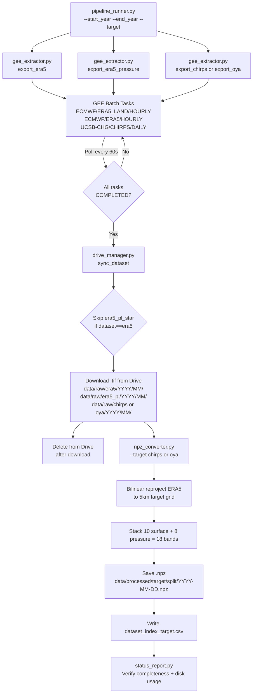

---
tags:
  - pipeline/step1
  - data-extraction
  - gee
  - implementation
created: 2026-05-12
updated: 2026-05-16
status: implemented
---

# Step 1: Data Extraction & Acquisition

> [!IMPORTANT]
> **Status:** ✅ Implemented. Pipeline verified end-to-end. **2004–2013 data (CHIRPS + ERA5 surface + ERA5 pressure levels) is fully downloaded and converted to NPZ.** The 2014–2019 extraction has not yet been completed (see §10 for current metrics).

## Overview

This step retrieves all raw data required for the comparative downscaling experiment (Saha & Ravela 2024). The output is a set of structured, paired `.npz` files on local disk containing ERA5 inputs (surface + pressure levels = **18 bands total**) and the two competing high-resolution targets.

**Two parallel pipelines are maintained:**

| Pipeline | Target | Resolution | Source |
| -------- | ------ | ---------- | ------ |
| **A** | CHIRPS | 0.05° (~5km) | Station-blended satellite |
| **B** | Oya | 0.05° (~5km) | AI-derived nowcasting (Google) |

---

## 1. Environment Setup

### 1.1 `.env` Configuration

File: `.env` (root of project, **never committed to git**).

```dotenv
# Google Cloud / Earth Engine
GOOGLE_CLOUD_PROJECT_ID=precipitation-dowscaling
GOOGLE_APPLICATION_CREDENTIALS=./auth/service_account.json
GOOGLE_DRIVE_CREDENTIALS=./auth/service_account.json

# Storage & Paths
LOCAL_DATA_DIR=./data/era5_oya_mexico
RAW_DATA_DIR=./data/raw
PROCESSED_DATA_DIR=./data/processed

# GEE Export Configuration
GEE_DRIVE_FOLDER=Precipitation_Exports

# Shapefiles
ATLANTICO_SHP_PATH=./data/shape_files/atlantico_shp/atlantico_shp_grande.shp
PACIFICO_SHP_PATH=./data/shape_files/pacifico_shp/pacifico_shp_grande.shp
```

> [!WARNING]
> `GOOGLE_DRIVE_CREDENTIALS` points to the same service account as `GOOGLE_APPLICATION_CREDENTIALS`. This works only if the service account has been **shared** on the target Google Drive folder (`Precipitation_Exports`). The Drive API scope used is `https://www.googleapis.com/auth/drive` (read + delete).

### 1.2 `auth/` Directory

| File | Purpose |
| ---- | ------- |
| `auth/service_account.json` | GCP Service Account key for both GEE and Drive API authentication. Project: `precipitation-dowscaling`. |

### 1.3 `src/utils/config.py` — Central Configuration

All scripts import `Config` from this module. It handles:
- Loading `.env` via `python-dotenv`
- Exposing typed attributes for all env vars
- **Automatic directory initialization** on every import
- **Centralized logger** (`PrecipitationPipeline`)

```python
from src.utils.config import Config

logger = Config.get_logger()  # Returns a shared logging.Logger
Config.PROJECT_ID              # precipitation-dowscaling
Config.RAW_DATA_DIR            # ./data/raw
Config.GEE_DRIVE_FOLDER        # Precipitation_Exports
```

**Directories auto-created on import:**
```
data/era5_oya_mexico/
data/raw/
data/raw/era5/
data/raw/era5_pl/     ← pressure levels
data/raw/chirps/
data/raw/oya/
data/raw/dem/
data/processed/
```

> [!NOTE]
> The logger format is: `%(asctime)s - PrecipitationPipeline - %(levelname)s - %(message)s`
> All scripts use `logger = Config.get_logger()` at module level — no duplicate handlers.

---

## 2. Geographic Domain & Coverage

### 2.1 Basin Shapefiles

| Basin | File | LON range | LAT range |
| ----- | ---- | --------- | --------- |
| **Atlantic** | `atlantico_shp/atlantico_shp_grande.shp` | −98.9° to −38.7° | 5.1°N to 32.5°N |
| **Pacific** | `pacifico_shp/pacifico_shp_grande.shp` | −133.5° to −80.7° | 5.0°N to 33.8°N |

> [!IMPORTANT]
> Shapefiles are **irregular polygons**, not bounding boxes. During GEE **extraction**, the convex hull is used. During **masking and evaluation**, the individual shapefiles are applied to separate Atlantic-facing from Pacific-facing dynamics.

### 2.2 Countries Covered

| Country / Territory | Atlantic Basin | Pacific Basin |
| ------------------- | :---: | :---: |
| Mexico | Yes (Gulf + Yucatan) | Yes (Pacific coast) |
| Guatemala | Yes | Yes |
| Belize | Yes | No |
| Honduras | Yes | Yes |
| El Salvador | Yes | Yes |
| Nicaragua | Yes | Yes |
| Costa Rica | Yes | Yes |
| Panama | Yes | Yes |
| Cuba | Yes | No |
| Caribbean Islands (western) | Yes | No |
| Eastern Pacific Ocean | No | Yes |

### 2.3 Extraction Domain: 9-Point Convex Hull

All GEE exports use this polygon — the tightest hull that fully contains both basins.

| Vertex | Longitude | Latitude | Description |
| ------ | --------- | -------- | ----------- |
| 1 | −133.471 | 18.626 | NW — open Pacific |
| 2 | −124.199 | 33.753 | N — Baja California North |
| 3 | −61.429 | 32.525 | NE — Caribbean North |
| 4 | −38.653 | 29.721 | E — open Atlantic North |
| 5 | −38.653 | 18.490 | E — open Atlantic Mid |
| 6 | −38.689 | 5.288 | SE — Atlantic equatorial |
| 7 | −53.015 | 5.069 | S — Guyana coast |
| 8 | −80.666 | 4.970 | S — Panama/Colombia |
| 9 | −117.667 | 5.101 | SW — Eastern Pacific equatorial |

```python
# Defined in gee_extractor.py — initialized after ee.Initialize()
DOMAIN_POLYGON = ee.Geometry.Polygon([[
    [-133.471, 18.626],  # NW  -- open Pacific
    [-124.199, 33.753],  # N   -- Baja California North
    [-61.429,  32.525],  # NE  -- Caribbean North
    [-38.653,  29.721],  # E   -- open Atlantic North
    [-38.653,  18.490],  # E   -- open Atlantic Mid
    [-38.689,   5.288],  # SE  -- Atlantic equatorial
    [-53.015,   5.069],  # S   -- Guyana coast
    [-80.666,   4.970],  # S   -- Panama/Colombia
    [-117.667,  5.101],  # SW  -- Eastern Pacific equatorial
]])
```

---

## 3. Input Data: ERA5

### 3.1 Surface Bands (10 bands) — `ECMWF/ERA5_LAND/HOURLY`

| Collection | Resolution | Cadence | Export scale |
| ---------- | ---------- | ------- | ------------ |
| `ECMWF/ERA5_LAND/HOURLY` | 0.25° (~25km) | Hourly → daily | 27,750m |

| # | Band Name | Units | Aggregation | Role |
|---|-----------|-------|-------------|------|
| 1 | `total_precipitation_hourly` | m/day | **Sum** | Low-res precip signal |
| 2 | `temperature_2m` | K | Mean | Convection driver |
| 3 | `dewpoint_temperature_2m` | K | Mean | Surface moisture |
| 4 | `surface_pressure` | Pa | Mean | Orographic signature |
| 5 | `u_component_of_wind_10m` | m/s | Mean | Zonal moisture flux |
| 6 | `v_component_of_wind_10m` | m/s | Mean | Meridional moisture flux |
| 7 | `surface_solar_radiation_downwards_hourly` | J/m² | Mean | Convective initiation |
| 8 | `surface_sensible_heat_flux_hourly` | J/m² | Mean | Boundary layer instability |
| 9 | `surface_latent_heat_flux_hourly` | J/m² | Mean | Evapotranspiration signal |
| 10 | `volumetric_soil_water_layer_1` | frac | Mean | Antecedent soil moisture |

**Daily aggregation logic:**
```python
daily_precip = era5.select(['total_precipitation_hourly']).sum()
daily_others = era5.select(OTHER_BANDS).mean()
daily_image  = daily_precip.addBands(daily_others)
```

### 3.2 Pressure Level Bands (8 bands) — `ECMWF/ERA5/HOURLY`

| Collection | Resolution | Cadence | Export scale |
| ---------- | ---------- | ------- | ------------ |
| `ECMWF/ERA5/HOURLY` | 0.25° | Hourly -> daily mean | 27,750m |

> [!WARNING]
> The `ECMWF/ERA5/DAILY` collection **does not include pressure levels in GEE**. Both `gee_extractor.py` and `pipeline_runner.py` correctly use `ECMWF/ERA5/HOURLY` and take a daily `.mean()`. The 8 bands below are the actual bands verified in the downloaded files.

| # | Band | Pressure Level | Units |
|---|------|---------------|-------|
| 1 | `temperature_500hPa` | 500 hPa | K |
| 2 | `temperature_850hPa` | 850 hPa | K |
| 3 | `u_component_of_wind_500hPa` | 500 hPa | m/s |
| 4 | `u_component_of_wind_850hPa` | 850 hPa | m/s |
| 5 | `v_component_of_wind_500hPa` | 500 hPa | m/s |
| 6 | `v_component_of_wind_850hPa` | 850 hPa | m/s |
| 7 | `relative_humidity_500hPa` | 500 hPa | % |
| 8 | `relative_humidity_850hPa` | 850 hPa | % |

> [!NOTE]
> Pressure level data is exported independently as `era5_pl_YYYY-MM-DD.tif` and stored under `data/raw/era5_pl/`. It is stacked with ERA5 surface data in `npz_converter.py` to produce the final **18-band** input tensor (10 surface + 8 pressure levels).

---

## 4. Target Datasets

### 4.1 Target A: CHIRPS — Pipeline A

| Property | Value |
| -------- | ----- |
| GEE ID | `UCSB-CHG/CHIRPS/DAILY` |
| Resolution | 0.05° (~5km) |
| Cadence | Daily (already daily, no aggregation needed) |
| Band | `precipitation` (mm/day) |
| Availability | 1981-01-01 to present |
| Used period | **2004-01-01 to 2019-12-31** |

**Processing notes:**
- Pixels with `precipitation < 0` (fill value = −9999) are masked.
- Export scale: 5,566m.
- Exported as one `.tif` per day per month.

### 4.2 Target B: Oya — Pipeline B

| Property | Value |
| -------- | ----- |
| GEE ID | `projects/global-precipitation-nowcast/assets/global_estimation` |
| Resolution | 0.05° (~5km) |
| Cadence | 30-min → **aggregated to daily** |
| Band | `precipitation` (mm/hr) |
| Availability | 2004-01-01 to present |

**Unit conversion and aggregation:**
```python
# 48 images per UTC day (30-min cadence)
# mm/hr × 0.5 hr = mm per slot; sum = mm/day
daily_oya = oya.filterDate(d_start, d_end).sum().multiply(0.5)
```

> [!WARNING]
> The 2004 start year is **constrained by Oya's availability**. CHIRPS data from 1981 exists, but is not used before 2004 to keep both pipelines comparable.

### 4.3 Topography: NASADEM

| Property | Value |
| -------- | ----- |
| GEE ID | `NASA/NASADEM_HGT/001` |
| Resolution | ~30m → resampled to 1km for export |
| Band | `elevation` (meters) |
| Cadence | Static (single export) |
| Output | `data/raw/dem/nasadem_mexico_1km.tif` |

Used by the **Upslope and Spectral physics models** in Step 2.

---

## 5. Data Splits

| Split | Period | ~Days | Purpose |
| ----- | ------ | ----- | ------- |
| **train** | 2004-01-01 – 2015-12-31 | 4,383 | Model learning; covers ENSO variability |
| **val** | 2016-01-01 – 2017-12-31 | 730 | Hyperparameter tuning & model selection |
| **test** | 2018-01-01 – 2019-12-31 | 730 | Final held-out evaluation |

Split logic is determined in `npz_converter.py` by `get_split(date_str)`:
```python
def get_split(date_str):
    year = datetime.strptime(date_str, "%Y-%m-%d").year
    if 2004 <= year <= 2015: return "train"
    elif 2016 <= year <= 2017: return "val"
    elif 2018 <= year <= 2019: return "test"
    else: return "other"
```

---

## 6. Directory Layout

After Step 1 completes, the `data/` structure is:

```
data/
├── shape_files/
│   ├── atlantico_shp/atlantico_shp_grande.shp
│   └── pacifico_shp/pacifico_shp_grande.shp
├── raw/
│   ├── era5/
│   │   └── YYYY/MM/era5_YYYY-MM-DD.tif          ← 10 surface bands
│   ├── era5_pl/
│   │   └── YYYY/MM/era5_pl_YYYY-MM-DD.tif        <- 8 pressure bands
│   ├── chirps/
│   │   └── YYYY/MM/chirps_YYYY-MM-DD.tif
│   ├── oya/
│   │   └── YYYY/MM/oya_YYYY-MM-DD.tif
│   └── dem/
│       └── nasadem_mexico_1km.tif
├── processed/
│   ├── chirps/
│   │   ├── train/YYYY-MM-DD.npz
│   │   ├── val/YYYY-MM-DD.npz
│   │   └── test/YYYY-MM-DD.npz
│   └── oya/
│       ├── train/YYYY-MM-DD.npz
│       ├── val/YYYY-MM-DD.npz
│       └── test/YYYY-MM-DD.npz
├── era5_oya_mexico/
│   └── metadata/
│       ├── dataset_index_chirps.csv    ← populated by npz_converter
│       └── dataset_index_oya.csv
└── logs/
```

**Each `.npz` file contains:**

| Key | Shape | Dtype | Description |
|-----|-------|-------|-------------|
| `inputs` | `(H, W, 18)` | float32 | ERA5 surface (10) + pressure levels (8), bilinearly resampled to 5km |
| `target` | `(H, W, 1)` | float32 | CHIRPS or Oya daily precipitation in mm/day |
| `date` | scalar string | str | ISO date e.g. `"2007-08-14"` |

**`dataset_index_{target}.csv` columns:**

| Column | Description |
| ------ | ----------- |
| `date` | ISO date string |
| `split` | `train`, `val`, or `test` |
| `era5_path` | Absolute path to ERA5 surface `.tif` |
| `era5_pl_path` | Absolute path to ERA5 pressure level `.tif` |
| `target_path` | Absolute path to CHIRPS/Oya `.tif` |
| `npz_path` | Absolute path to output `.npz` |
| `valid_flag` | `True` if file was successfully created |

---

## 7. Script Reference

### 7.1 `src/utils/config.py`

**Purpose:** Single source of truth for all configuration, directory initialization, and logging.

| Method | Returns | Description |
| ------ | ------- | ----------- |
| `Config.get_logger()` | `logging.Logger` | Singleton shared logger with timestamped formatter |
| `Config.init_directories()` | None | Called on import; creates all required `data/` subdirs |

### 7.2 `src/data_extraction/gee_extractor.py`

**Purpose:** Submit GEE export tasks for all datasets.

**CLI:**
```bash
python src/data_extraction/gee_extractor.py --dataset era5 --start 2004-01 --end 2004-03
python src/data_extraction/gee_extractor.py --dataset chirps --start 2004-01 --end 2019-12
python src/data_extraction/gee_extractor.py --dataset oya --start 2004-01 --end 2019-12
python src/data_extraction/gee_extractor.py --dataset dem
```

**Key functions:**

| Function | Exports to Drive prefix | Scale | Description |
| -------- | ----------------------- | ----- | ----------- |
| `export_era5(year, month, folder)` | `era5/YYYY/MM/` | 27,750m | 10 surface bands — one task per day |
| `export_era5_pressure(year, month, folder)` | `era5_pl/YYYY/MM/` | 27,750m | 8 pressure level bands (temp + wind + humidity at 500/850 hPa) — one task per day |
| `export_chirps(year, month, folder)` | `chirps/YYYY/MM/` | 5,566m | Daily CHIRPS, masks fill values < 0 |
| `export_oya(year, month, folder)` | `oya/YYYY/MM/` | 5,566m | Aggregates 48 x 30-min images to daily mm/day |
| `export_dem(folder)` | `dem/` | 1,000m | Single static NASADEM export |
| `initialize_gee()` | -- | -- | Authenticates with user OAuth (Drive exports) or service account fallback, sets `DOMAIN_POLYGON` |

**CLI:**
```bash
# Export ERA5 surface + pressure levels together
python src/data_extraction/gee_extractor.py --dataset era5 --start 2004-01 --end 2004-03

# Export pressure levels only (independent run)
python src/data_extraction/gee_extractor.py --dataset era5_pl --start 2004-01 --end 2004-03

# Export CHIRPS
python src/data_extraction/gee_extractor.py --dataset chirps --start 2004-01 --end 2019-12

# Export Oya
python src/data_extraction/gee_extractor.py --dataset oya --start 2004-01 --end 2019-12

# Export DEM (one-off)
python src/data_extraction/gee_extractor.py --dataset dem
```

> [!NOTE]
> `initialize_gee()` must be called before any export function. The `DOMAIN_POLYGON` is a module-level variable set to `None` until initialization, which prevents accidental use before auth. Drive exports require **user OAuth credentials** (`ee.Initialize()` without a service account). The service account fallback is for read-only / GCS-based operations only.

### 7.3 `src/data_extraction/drive_manager.py`

**Purpose:** Download completed GeoTIFFs from Google Drive and delete them from Drive after successful download to prevent storage overload.

**CLI:**
```bash
python src/data_extraction/drive_manager.py --dataset era5
python src/data_extraction/drive_manager.py --dataset era5_pl
python src/data_extraction/drive_manager.py --dataset chirps
```

**Key functions:**

| Function | Description |
| -------- | ----------- |
| `get_drive_service()` | Authenticates with service account, returns Drive API client |
| `find_folder(service, name)` | Returns Drive folder ID by name |
| `download_file(service, id, name, dest)` | Downloads file to `dest` path |
| `delete_file(service, id, name)` | Deletes file from Drive after download |
| `sync_dataset(dataset)` | Full sync: finds → downloads → deletes for a dataset |

> [!IMPORTANT]
> Drive scope used is `https://www.googleapis.com/auth/drive` (not `drive.readonly`), as **deletion requires write permissions**. Files are deleted from Drive whether they are newly downloaded **or already existed locally** — ensuring the Drive folder stays clean after every run.

> [!WARNING]
> **Known Bug (Fixed 2026-05-16):** The Drive search query `name contains 'era5'` was inadvertently matching both `era5_*.tif` and `era5_pl_*.tif` files, causing pressure-level files to be downloaded into the `data/raw/era5/` surface directory. This polluted the ERA5 folder with 3,529 duplicate files.
>
> **Fix:** `sync_dataset()` now explicitly skips any file starting with `era5_pl_` when the requested dataset is `era5`:
> ```python
> if dataset == "era5" and file_name.startswith("era5_pl_"):
>     continue
> ```
> The 3,529 misplaced files were deleted from both `data/raw/era5/` and `/mnt/data/downscaling/era5/` on 2026-05-16.

### 7.4 `src/data_extraction/npz_converter.py`

**Purpose:** Read matched ERA5 + ERA5_PL + Target GeoTIFFs per date, bilinearly resample ERA5 to the 5km target grid, stack all 18 bands, and save as compressed `.npz`.

**CLI:**
```bash
python src/data_extraction/npz_converter.py --target chirps
python src/data_extraction/npz_converter.py --target oya
```

**Processing pipeline per date:**

```
era5_YYYY-MM-DD.tif  (10 bands, 0.25°)  ─┐
                                           ├─ bilinear reproject to 5km grid
era5_pl_YYYY-MM-DD.tif (8 bands, 0.25°) ─┘
                                           ↓
                            np.concatenate → (H, W, 18)
                                           +
target_YYYY-MM-DD.tif (1 band, 0.05°)    → (H, W, 1)
                                           ↓
                      YYYY-MM-DD.npz  {inputs, target, date}
```

**Resampling implementation:**
```python
reproject(
    source=era5_data,           # (Bands, H_src, W_src)
    destination=resampled_era5, # (Bands, H_tgt, W_tgt)
    src_transform=era5_src.transform,
    src_crs=era5_src.crs,
    dst_transform=tgt_transform,  # from target .tif
    dst_crs=tgt_crs,
    resampling=Resampling.bilinear
)
```

> [!NOTE]
> The target `.tif` CRS and transform define the output grid. ERA5 is always reprojected **to match the target**, never the other way around.

### 7.5 `src/data_extraction/pipeline_runner.py`

**Purpose:** End-to-end orchestrator that runs the full extraction pipeline for a range of years, month by month.

**CLI:**
```bash
# Full 2004-2019 run for CHIRPS
python src/data_extraction/pipeline_runner.py --start_year 2004 --end_year 2019 --target chirps

# Test run for January 2004 only
python src/data_extraction/pipeline_runner.py --start_year 2004 --end_year 2004 --target chirps
```

**Monthly execution flow:**
```
For each month in [start_year..end_year]:
  1. Submit GEE tasks → export_era5() + export_era5_pressure() + export_chirps/oya()
  2. Poll GEE API (every 60s) → wait_for_tasks() until all COMPLETED or FAILED
  3. Download from Drive → drive_manager.sync_dataset() for era5, era5_pl, target
  4. Convert to NPZ → npz_converter.run_conversion()
```

> [!WARNING]
> This script is **blocking** — it polls GEE until each month's exports finish before proceeding. Typical GEE export times range from **5–30 minutes per month** depending on dataset size and GEE queue load.

### 7.6 `src/data_extraction/gcs_manager.py`

**Purpose:** Alternative download backend that syncs GeoTIFFs from Google Cloud Storage (GCS) instead of Google Drive. Used when GEE exports are directed to a GCS bucket rather than Drive.

**CLI:**
```bash
python src/data_extraction/gcs_manager.py --dataset era5
python src/data_extraction/gcs_manager.py --dataset era5_pl
python src/data_extraction/gcs_manager.py --dataset chirps
```

**Key functions:**

| Function | Description |
| -------- | ----------- |
| `get_gcs_client()` | Authenticates with service account, returns a GCS storage client |
| `sync_dataset(dataset)` | Downloads all blobs matching `{dataset}/` prefix from the configured GCS bucket, saves to local `data/raw/`, then deletes the blob from GCS |

> [!NOTE]
> `gcs_manager.py` reads `Config.GCS_BUCKET_NAME` from `.env`. This module is not used by the default `pipeline_runner.py` (which uses Drive), but is available for GCS-based workflows.

### 7.7 `src/utils/status_report.py`

**Purpose:** Verify the Step 1 success metrics automatically.

**CLI:**
```bash
python src/utils/status_report.py --target chirps --start 2004 --end 2019
```

**Checks performed:**

| Check | Metric | Method |
| ----- | ------ | ------ |
| **Extraction Completeness** | % of expected days with `valid_flag=True` | Cross-references calendar against `dataset_index_{target}.csv` |
| **Storage Efficiency** | Total GB + average MB/day | Scans `data/processed/{target}/` for `.npz` files |

**Example output:**
```
==================================================
PIPELINE STATUS REPORT
==================================================
2026-05-12 - INFO - Completeness Metric: 98.5% (5380/5843)
2026-05-12 - WARNING - Missing 87 dates. First few: [2004-03-15, 2004-03-16...]
--------------------------------------------------
2026-05-12 - INFO - Storage Efficiency Metric for chirps:
2026-05-12 - INFO -   Total NPZ files: 5380
2026-05-12 - INFO -   Total disk space used: 142.7 GB
2026-05-12 - INFO -   Average size per day: 27.2 MB
==================================================
```

---

## 8. Test Scripts

### 8.1 `tests/test_gee_auth.py`

**Purpose:** Verify that GEE initializes correctly with the service account and can execute a basic server-side computation.

```bash
python tests/test_gee_auth.py
```

**Checks:**
- Service account key file exists at path from `Config.SERVICE_ACCOUNT_FILE`
- `ee.Initialize()` succeeds
- `ee.Number(1).add(1).getInfo()` returns `2`

### 8.2 `tests/test_gee_sampling.py`

**Purpose:** Submit a single 1-day ERA5 export task to verify aggregation logic and GEE connectivity end-to-end.

```bash
python tests/test_gee_sampling.py
```

**Submits:** `era5_2004-01-01` export to `Precipitation_Test_Exports` Drive folder.
**Expected output:** `SUCCESS: Submitted 1-day ERA5 export test task: <TASK_ID>`

> [!NOTE]
> This test was run successfully on 2026-05-12 and returned Task ID `5FT4N2VOOIMXRIMHLQEAOZA2`, confirming the GEE connection and export configuration are valid.

### 8.3 `tests/test_raster_alignment.py`

**Purpose:** Verify that a pair of downloaded ERA5 and Target `.tif` files share the same CRS and have overlapping spatial bounds.

```bash
python tests/test_raster_alignment.py data/raw/era5/2004/01/era5_2004-01-01.tif \
                                       data/raw/chirps/2004/01/chirps_2004-01-01.tif
```

**Checks:**
- Both files exist
- CRS matches
- Spatial bounds intersect

---

## 9. Pipeline Flow Diagram



---

## 10. Success Metrics Status

> [!NOTE]
> Metrics last verified: **2026-05-16**. Coverage runs from **2004 to 2013 only**. The 2014-2019 range has not yet been fully extracted.

### Current Data Coverage

| Dataset | Years Available | Files | Notes |
| ------- | --------------- | ----- | ----- |
| **CHIRPS** | 2004-2013 | 3,653 `.tif` | Target precipitation |
| **ERA5 surface** | 2004-2013 | 3,653 `.tif` | 10 bands each |
| **ERA5 pressure levels** | 2004-2013 | 3,653 `.tif` | 8 bands each |
| **DEM** | -- | 0 | Not yet extracted |
| **OYA** | -- | 0 | Not yet extracted |

### Verified Quality Metrics (2026-05-16)

| Metric | Result | Detail |
| ------ | ------ | ------ |
| **CHIRPS completeness** | **99.95%** (3,651/3,653 days) | Missing: 2012-05-23, 2012-05-25 |
| **CHIRPS value range** | 0.0 – 122.5 mm/day | Physically plausible ✅ |
| **ERA5 temperature range** | 256K – 302K | Physically plausible ✅ |
| **ERA5 pressure range** | 66kPa – 102kPa | Physically plausible ✅ |
| **ERA5-PL valid pixel coverage** | ~84.7% per band | Expected ocean/domain masking ✅ |
| **ERA5 surface valid pixel coverage** | ~20.3% per band | Expected land mask within domain ✅ |
| **NPZ files created** | 3,651 | Stored in `data/processed/chirps/train/` |
| **Total processed storage** | **137.39 GB** | 38.53 MB avg per day |
| **ERA5 directory pollution** | ✅ Cleaned | 3,529 misplaced `era5_pl` files removed |

### Remaining Gaps

| Gap | Priority | Action Needed |
| --- | -------- | ------------- |
| DEM not extracted | High | Run `python src/data_extraction/gee_extractor.py --dataset dem` |
| 2014–2019 data missing | High | Re-run pipeline for `--start_year 2014 --end_year 2019` |
| OYA not extracted | Medium | Run pipeline with `--target oya` |
| 2 CHIRPS days missing (2012-05-23, 2012-05-25) | Low | Check GEE availability; likely no CHIRPS data for those dates |

### Original Targets

| Metric | Target | Status |
| ------ | ------ | ------ |
| **Extraction Completeness** | 100% of 2004-2019 days | ⚠️ 2004-2013 complete; 2014-2019 pending |
| **Data Alignment** | 0-pixel offset | ✅ `test_raster_alignment.py` ready |
| **Storage Efficiency** | Compressed `.npz` | ✅ Uses `savez_compressed` |
| **Reproducibility** | `dataset_index.csv` maps every date | ✅ Auto-generated |

---

## 11. How to Run

### Quick Test (1 month)
```bash
# Activate environment
source venv/bin/activate

# 1. Verify auth
python tests/test_gee_auth.py

# 2. Submit a test export
python tests/test_gee_sampling.py

# 3. Run full pipeline for Jan 2004
python src/data_extraction/pipeline_runner.py \
    --start_year 2004 --end_year 2004 --target chirps

# 4. Verify metrics
python src/utils/status_report.py --target chirps --start 2004 --end 2004
```

### Full 2004–2019 Extraction
```bash
# CHIRPS (Pipeline A)
python src/data_extraction/pipeline_runner.py \
    --start_year 2004 --end_year 2019 --target chirps

# Oya (Pipeline B) — can run in parallel in a second terminal
python src/data_extraction/pipeline_runner.py \
    --start_year 2004 --end_year 2019 --target oya

# Export DEM (one-off, run once)
python src/data_extraction/gee_extractor.py --dataset dem
```

> [!CAUTION]
> Running both pipelines simultaneously will double the number of concurrent GEE export tasks. GEE has a limit of **3,000 concurrent tasks** per project. Monitor at https://code.earthengine.google.com/tasks.

---

## 12. Glossary

| Term | Definition |
|------|-----------|
| **GEE** | Google Earth Engine -- cloud geospatial platform for querying and exporting gridded climate data |
| **ERA5** | ECMWF 5th-generation atmospheric reanalysis at 0.25°/hourly. Used as the low-resolution model input |
| **ERA5-Land** | `ECMWF/ERA5_LAND/HOURLY` -- hourly collection containing surface variables including soil moisture |
| **ERA5 Pressure Levels** | `ECMWF/ERA5/HOURLY` -- hourly collection from which pressure level bands are extracted by taking daily means. ECMWF/ERA5/DAILY does not expose pressure level bands in GEE |
| **CHIRPS** | Climate Hazards Group InfraRed Precipitation with Station data. 5km daily blended satellite+station product (1981-present) |
| **Oya** | Google Research quasi-global precipitation product at 5km/30-min. Derived from geostationary VIS-IR using a U-Net (2004-present) |
| **NASADEM** | NASA Shuttle Radar Topography Mission DEM at 30m, resampled to 1km for physics models |
| **NPZ** | NumPy compressed archive format (`.npz`) storing multiple named arrays per sample |
| **Bilinear resampling** | Spatial interpolation estimating values from the 4 nearest neighbours. Used to upsample ERA5 from 0.25° to the 5km target grid |
| **Convex hull** | Smallest convex polygon enclosing all shapefile vertices. Used as the GEE export region |
| **`dataset_index.csv`** | Master CSV listing every sample's paths, split, date, and validity. Primary entry point for Step 2 dataloaders |
| **Surface bands** | 10 ERA5-Land variables describing conditions at or near the Earth's surface |
| **Pressure level bands** | 8 ERA5 variables at 500/850 hPa: temperature, u-wind, v-wind, and relative humidity |

---

## 13. Related Notes

- [[architecture]] -- Full project architecture and methodology phases
- [[step1_implementation_plan]] -- Original implementation plan with open questions
- `src/utils/config.py` -- Configuration and logger
- `src/data_extraction/gee_extractor.py` -- GEE export functions
- `src/data_extraction/drive_manager.py` -- Drive download + cleanup
- `src/data_extraction/gcs_manager.py` -- GCS download + cleanup (alternative backend)
- `src/data_extraction/npz_converter.py` -- Format conversion and band stacking
- `src/data_extraction/pipeline_runner.py` -- End-to-end orchestrator
- `src/utils/status_report.py` -- Completeness and storage verification